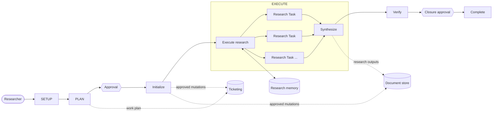

# Agentic Researcher

[](https://github.com/dmartinol/agentic-researcher/actions/workflows/validate.yml)
[](https://github.com/dmartinol/agentic-researcher/releases)
[](https://github.com/dmartinol/agentic-researcher/blob/main/LICENSE)
[](docs/evaluations.md)


Installable, portable agentic research system for planning, executing, documenting, and verifying evidence-based research.

The repository contains development material and a separate distributable package under `agentic-researcher/`. The package follows Agent Plugins v1 and Agent Skills:

- `agentic-researcher/plugin.json` is the portable plugin manifest.
- `agentic-researcher/skills/` contains portable Agent Skills.
- `agentic-researcher/mcp.json` declares the default portable Atlassian MCP connection and remains credentials-free.
- `agentic-researcher/AGENTS.md` contains concise runtime instructions for installed hosts.

Agent Plugins v1 does not standardize agent definitions. This project deliberately includes IDE-neutral Markdown agent definitions under `agentic-researcher/agents/` as a non-standard extension following the convention used by Claude plugins and compatible hosts. Skills implement reusable research operations; the installed agents provide the canonical multi-phase lifecycle orchestration.

## Providers and subsystems

Lifecycle skills use logical subsystem roles:

- `ticketing`
- `document_store`
- optional `repository`
- `identity`

Provider-specific behavior is composed through specialized skills. Jira and Confluence are the default providers, implemented by `jira-research` and `confluence-research`.

The plugin declares Atlassian's remote MCP endpoint in portable `agentic-researcher/mcp.json`. Authentication remains client-managed; the package contains no credentials. Alternative providers can satisfy the capability contracts documented in `agentic-researcher/docs/subsystem-capabilities.md`.

No host-specific adapter is required by the project architecture.

## Research lifecycle

The researcher sees four conceptual phases while the internal workflow keeps approval-gated initialization, parallel task execution, synthesis, verification, and completion explicit.



Internally, specialized setup, planning, initialization, execution, verification, and completion agents/skills preserve explicit approval and mutation boundaries.

## Research project

```text
RESEARCH.md       stable research definition and configuration
STATE.md          concise current/restart state
research/memory/  acquired claims, sources, and useful research history
research/reports/ research outputs
```

See `agentic-researcher/templates/RESEARCH.md`, `agentic-researcher/templates/STATE.md`, and `docs/research-memory.md`.

## Skills

Lifecycle skills:

- `setup-research`
- `plan-research`
- `initialize-research`
- `execute-research`
- `verify-research`
- `complete-research`

Research capabilities:

- `research-evidence`: source quality, claims, contradiction search, freshness
- `manage-research-memory`: durable claims/sources/episodes and selective retrieval
- `research-synthesis`: traceable synthesis across evidence and dependent tasks

Provider specializations:

- `jira-research`
- `confluence-research`

`agentic-researcher/agents/` contains the IDE-neutral orchestrator and specialized phase-agent definitions.

## Evaluations

Nine of the eleven individual skills have published Iteration 0 evaluations using isolated **with-skill vs baseline** runs. Results are reported as measured assertion pass rates and absolute percentage-point deltas, with machine-readable benchmarks and run artifacts retained in the repository.

See [Evaluation results](docs/evaluations.md) for the scorecard, methodology notes, coverage, and links to the underlying evidence.

## Install and validate

Researchers install the package using their host's plugin/skill installation mechanism; cloning this development repository is not part of the research workflow. See `docs/getting-started.md`.

Contributors can run `python scripts/validate.py` and `pytest -q`. CI enforces package structure and the generic/provider architecture boundary.

The reproducible product demo is documented in `docs/demo-script.md` and `examples/demo-research/`.

See root `AGENTS.md` for contributor/development instructions and `agentic-researcher/AGENTS.md` for installed runtime instructions, `docs/architecture.md` for the architecture model, and `TODO.md` for the remaining roadmap.
