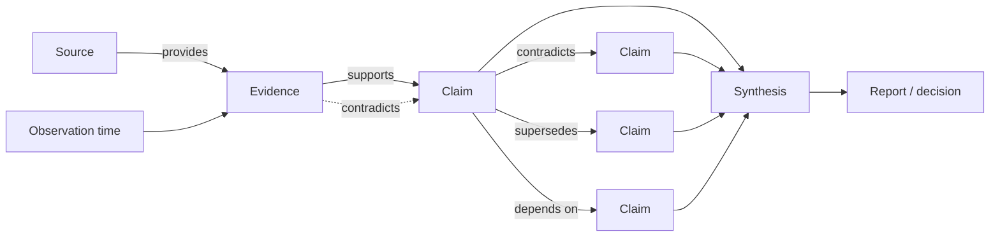
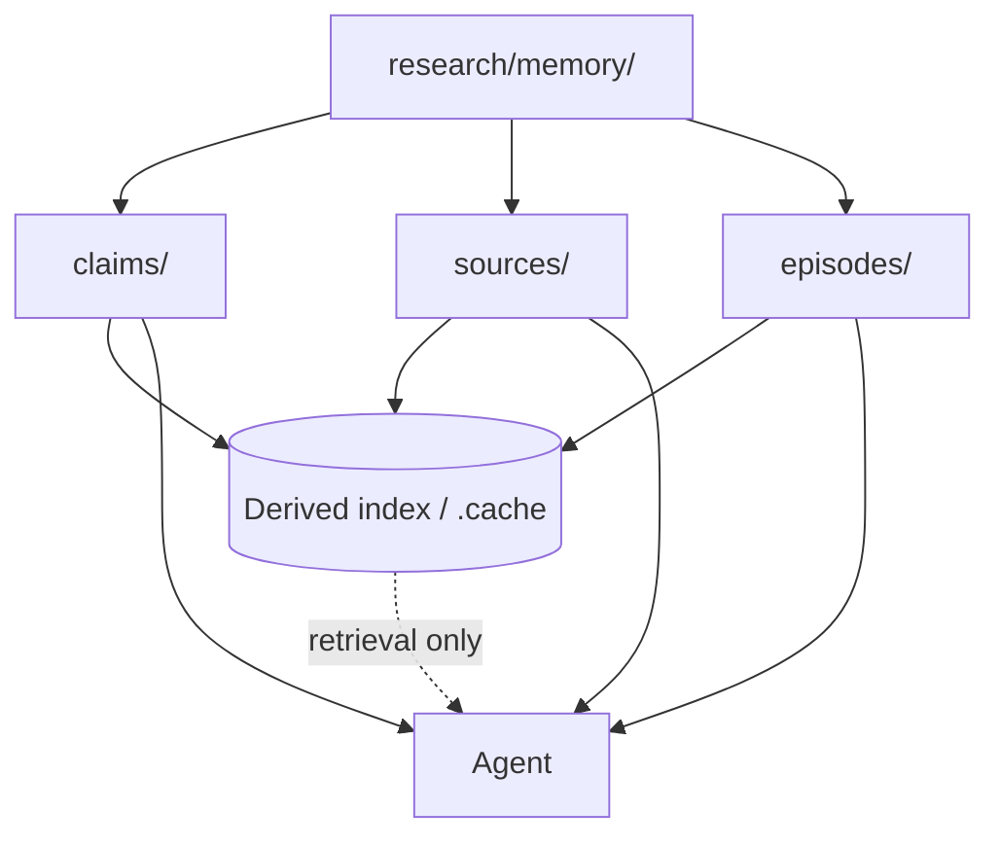

# Research Memory

Persistent research artifacts are the agent's durable memory. Do not rely on conversation history as durable knowledge.

The goal is to preserve **research findings, evidence, provenance, uncertainty, and useful research history** across context windows, agent sessions, IDEs, and team members.

## Relationship to RESEARCH.md and STATE.md

Research projects use three distinct kinds of durable local state:

- `RESEARCH.md`: stable research definition and configuration.
- `STATE.md`: concise, volatile restart state.
- `research/memory/`: authoritative acquired research knowledge.

Do not duplicate the full evidence store in `STATE.md`, and do not use `RESEARCH.md` for execution progress.

## Source of Truth

Use human-readable files as the authoritative research memory. Track them in Git when collaboration, review, history, or reproducibility is required.

Do **not** use SQLite, a vector database, embeddings, or another binary/index format as the only canonical source of truth.

Recommended project structure:

```text
RESEARCH.md
STATE.md
research/
├── memory/
│   ├── claims/
│   ├── sources/
│   └── episodes/
├── reports/
└── .cache/
```

Files under `.cache/` are derived artifacts and must be reproducible from canonical research files.

## Claims and Evidence

Do not store important research merely as free-form summaries. Represent significant findings as explicit claims with provenance.

Canonical claim, source, and episode shapes are defined by `templates/memory/claim.md`, `templates/memory/source.md`, and `templates/memory/episode.md`.

Claims use the project evidence labels `Verified`, `Reported`, `Not established`, and `Conflicting`. Do not add numeric confidence scores: confidence-like numbers imply a calibration the research process does not provide. Express uncertainty through evidence state, provenance, qualifications, conflicts, and unresolved gaps.

A claim records a precise statement, source relationships, observation/update time, scope qualifications, and relationships such as `contradicts`, `supersedes`, and `depends_on`.

A source records a stable location/identifier, source type, title, publication/version metadata when known, and retrieval time.

Prefer UUID/ULID-style identifiers over sequential IDs so multiple researchers and agents can create records concurrently without collisions.

## Executable Skills

The memory model is implemented by portable skills:

- `manage-research-memory`: canonical persistence, reconciliation, relationships, episodes, selective retrieval, and derived-index rules;
- `research-evidence`: source discovery/evaluation, claim extraction, contradiction search, and freshness/revalidation;
- `research-synthesis`: evidence-based synthesis across claims and dependent research tasks.

`execute-research` composes these capabilities and remains capable of generic research when no topic-specific skill is assigned.

## Research Lifecycle

For each significant research step:

1. Observe new information.
2. Extract factual claims.
3. Associate claims with supporting sources.
4. Verify important claims against primary or independent sources where practical.
5. Search for contradictory evidence when the claim materially affects the conclusion.
6. Compare new claims with existing research memory.
7. Record contradictions instead of silently overwriting previous findings.
8. Mark outdated findings as superseded when appropriate.
9. Record unresolved questions.
10. Update the concise current research state.

Never convert an assumption into a fact merely because it appeared in previous agent output.

## Provenance

Maintain the evidence chain and claim relationships explicitly:



The canonical filesystem keeps those durable objects inspectable and versionable:



Derived indexes aid retrieval but never replace the canonical research files.

Research conclusions must be traceable back to evidence.

## Time and Freshness

Technical facts can become obsolete. Record retrieval/publication dates and consider freshness when evaluating evidence.

When an existing claim may have become stale, revalidate it rather than assuming it remains correct.

Never overwrite an historically correct claim merely because the current state has changed. Preserve the previous claim and mark the relationship appropriately.

## Episodic Memory

Record research episodes only when they provide reusable value, such as successful or failed investigative approaches, misleading documentation that required verification, important research decisions, unresolved ambiguities, or discoveries about authoritative sources.

Do not record every tool invocation or intermediate thought.

## Procedural Memory

Agent Skills represent procedural knowledge: **how research should be performed**.

Research memory represents acquired knowledge: **what the research has discovered**.

Keep these separate. Do not automatically modify `SKILL.md` based on research experience. Skills are version-controlled software and should change deliberately.

## Retrieval

Do not load the complete research memory into the context window.

Retrieve only information relevant to the current task, including relevant claims, supporting evidence, conflicting claims, unresolved questions, previous conclusions, and useful research episodes.

Start with filesystem/lexical search where practical.

A local SQLite database may be generated from canonical files for indexing, full-text search, relationships, and efficient queries. It is a **derived cache** and should normally be Git-ignored.

For larger repositories, semantic/vector retrieval may supplement lexical search, but semantic similarity must never be interpreted as evidence that a claim is true.

## Collaboration

Research memory should support collaboration where the project requires it. Agents should make changes that humans and other agents can inspect, diff, review, merge, validate, and reproduce.

Prefer one file per claim/source when concurrent modifications are common rather than a single large JSON/JSONL file that creates frequent merge conflicts.

## Local and Shared Memory

A local project may use:

```text
human-readable research files
        |
        | canonical knowledge
        v
 local derived index
   (e.g. SQLite)
        |
        v
      Agent
```

For team-scale deployments, CI may build shared indexes from a Git-tracked research project:

```text
Git
 |
 v
CI / indexing
 |
 +-- relational/full-text index
 +-- optional vector index
 |
 v
Shared Research Service / MCP
```

The human-readable research files remain authoritative even when a shared search or MCP service is introduced.

## Research State

Maintain a small root-level `STATE.md` so a new agent session does not need to reconstruct current progress from historical artifacts.

It should summarize the current lifecycle phase and objective, work status, immediately relevant established findings, unresolved questions, contradictions requiring investigation, and next actions.

Keep `STATE.md` concise. It is working memory, not the evidence database.

## Core Rule

Do not remember the conversation.

**Remember the research.**

Durable memory should answer:

- What do we know?
- Why do we believe it?
- Where did the evidence come from?
- When was it observed?
- How confident are we?
- What contradicts it?
- What remains unknown?
- What should be investigated next?
